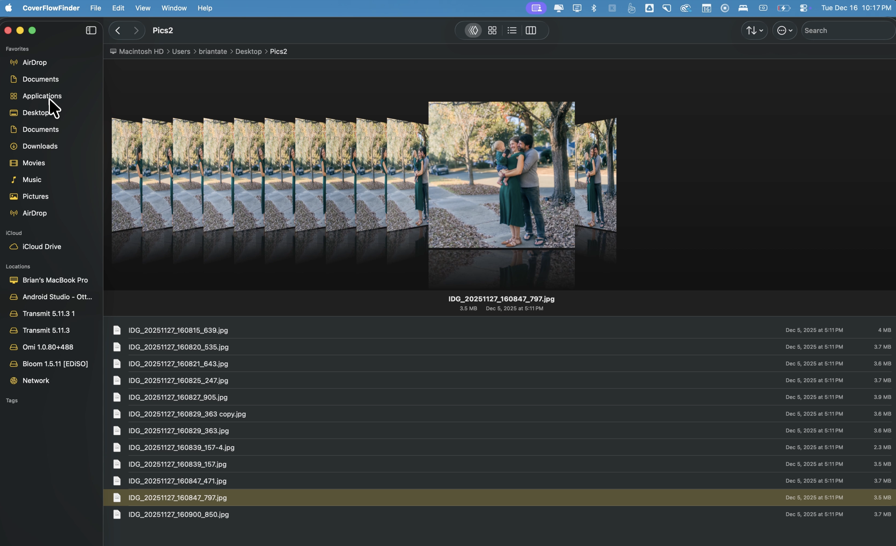

# CoverFlowFinder

A beautiful macOS file browser that brings back the classic Cover Flow view from older versions of Finder.

https://github.com/elliotttate/CoverFlowFinder/releases/download/v1.0.0/CoverFlowFinder-demo.mp4



## Features

- **Cover Flow View** - Browse your files with the iconic 3D carousel effect, complete with smooth animations and reflections
- **Multiple View Modes** - Switch between Cover Flow, Icons, List, Columns, and Dual Pane views
- **Dual Pane Mode** - Two independent file browsers side by side for easy file management
- **Quick Look Integration** - Press Space to preview any file with Quick Look
- **Full File Browser** - Navigate your entire file system with a familiar Finder-like interface
- **Sidebar Navigation** - Quick access to Favorites, iCloud, and mounted volumes
- **Sorting & Search** - Sort files by name, date, size, or kind; search to filter files instantly
- **Clipboard Operations** - Copy, Cut, Paste, and Duplicate files with keyboard shortcuts
- **Context Menus** - Right-click for quick access to file operations
- **Type-Ahead Search** - Start typing to jump to matching files instantly

## Requirements

- macOS 14.0 (Sonoma) or later
- Apple Silicon or Intel Mac

## Installation

### Download
Download the latest DMG from the [Releases](https://github.com/elliotttate/CoverFlowFinder/releases) page.

### Build from Source
1. Clone the repository:
   ```bash
   git clone https://github.com/elliotttate/CoverFlowFinder.git
   ```
2. Open `CoverFlowFinder.xcodeproj` in Xcode
3. Build and run (⌘R)

## Usage

### Navigation
- **Click** on a cover to select it
- **Double-click** or press **Return** to open files/folders
- **Arrow keys** to navigate between items
- **Scroll wheel** for smooth momentum scrolling through covers

### Keyboard Shortcuts
| Shortcut | Action |
|----------|--------|
| Space | Quick Look preview |
| Return | Open selected item |
| ← → ↑ ↓ | Navigate items |
| ⌘C | Copy |
| ⌘X | Cut |
| ⌘V | Paste |
| ⌘D | Duplicate |
| ⌘⌫ | Move to Trash |
| ⌘[ | Go back |
| ⌘] | Go forward |
| ⌘⇧N | New Folder |
| A-Z, 0-9 | Type-ahead search |

### View Modes
Use the toolbar buttons or View menu to switch between:
- Cover Flow (default)
- Icons
- List
- Columns
- Dual Pane

## Technical Details

### Architecture
- Built with SwiftUI for the main interface
- Native AppKit/Core Animation for the Cover Flow view (for optimal performance)
- QuickLookThumbnailing framework for generating file previews

### Performance Optimizations
- Lazy thumbnail loading with prioritization based on proximity to selection
- GPU-accelerated Core Animation transforms
- Efficient layer management with recycling for smooth scrolling

## License

MIT License - see [LICENSE](LICENSE) for details.

## Acknowledgments

Inspired by the classic Cover Flow view from iTunes and older versions of macOS Finder.
